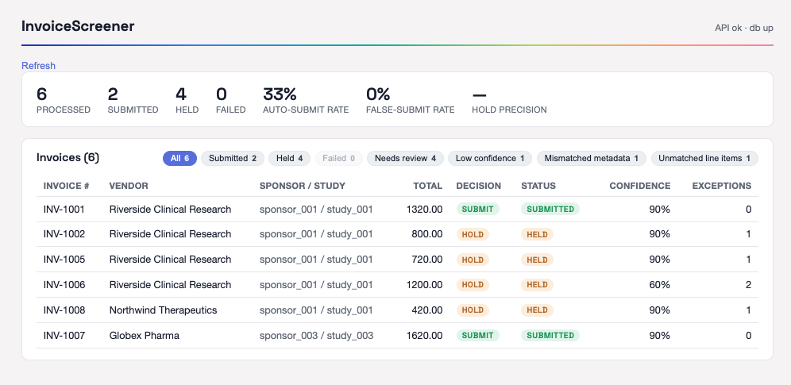
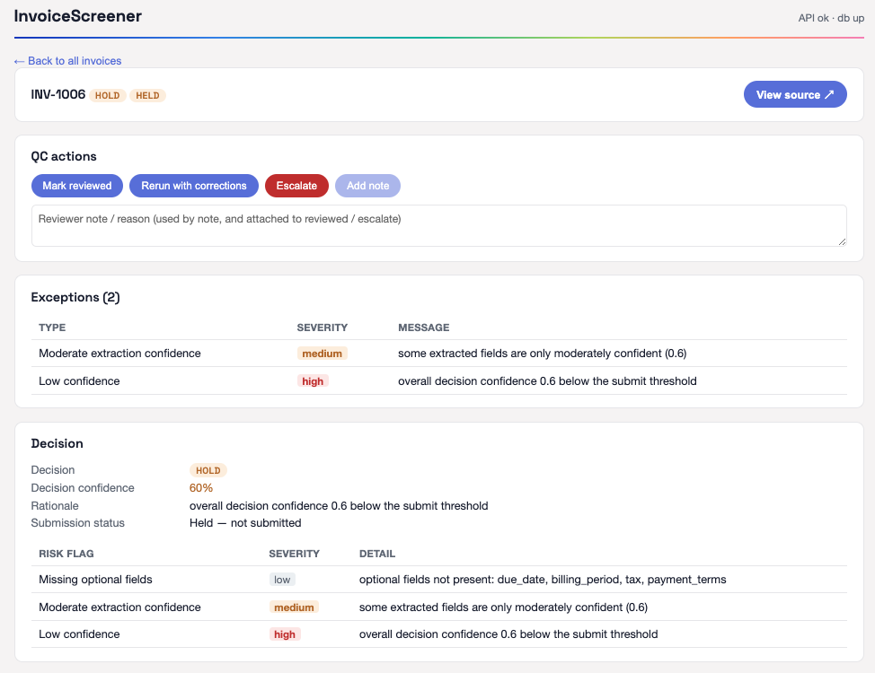
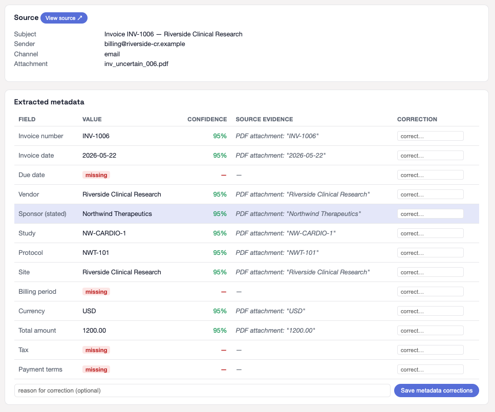
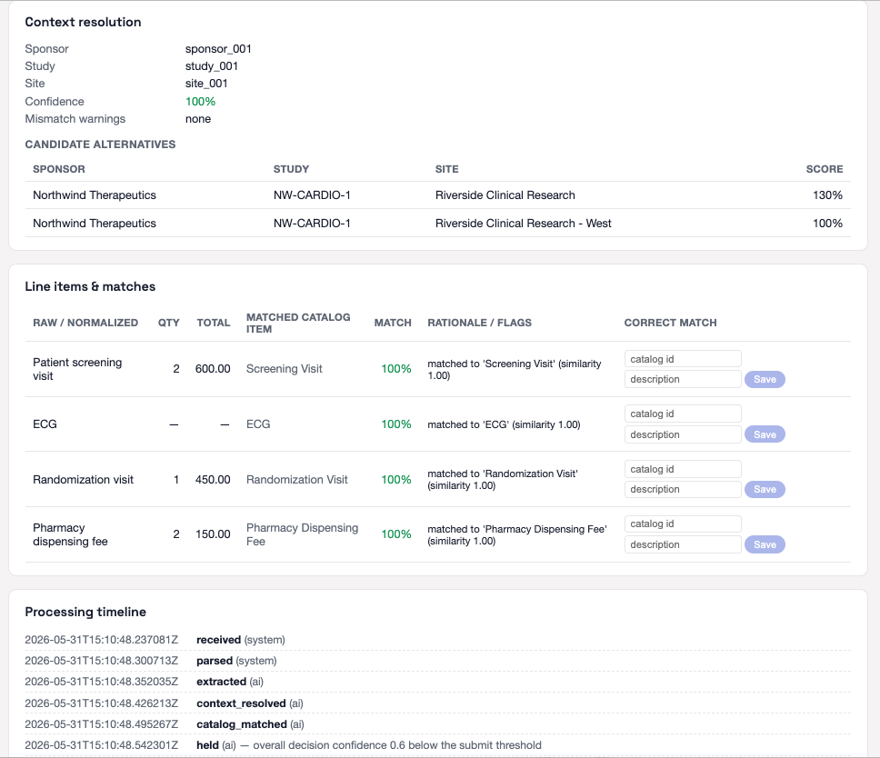

# IntakeHub

An **AI-first** workflow for clinical-trial site invoices: it interprets an
emailed invoice, resolves its sponsor/study/site context, matches line items to
the sponsor+study catalog, and **decides to submit to ClinRun or hold for
exceptions — without a human gate before decisioning**. Reviewers then get a
clear *post-decision* QC hub to understand outcomes, validate risk cases, and
intervene (correct / rerun / escalate / retry).

- **Live Dashboard page:** _redeploying under the new `intakehub-hub` service — Cloud Run regenerates the URL hash on the next deploy (see [`docs/DEPLOY.md`](docs/DEPLOY.md)). The prior `invoicescreener-hub-…run.app` link is retired._
- **Demo video: https://www.loom.com/share/0975477394ed4b47895f41821fdd3438**
#
## Overview page ##
- Summary of invoices received as pdf in inbox
- Key invoice information (Invoice #, Vendor, Sponsor, Amount, Status, Confidence Score, # of exceptions)
 
 #
## Key Features of Invoice Page ##
- Decision status, confidence, and reasoning
- Exception call outs: type, severity, human-readable context
- Link to viewable source PDF
- Line-item extracted metadata, with callout to value, confidence, evidence, and override
- Matching of line item charge to catalog items





#

[`docs/CHALLENGE_ASSESSMENT.md`](docs/CHALLENGE_ASSESSMENT.md) for a
requirement-by-requirement status.

## Quickstart (Docker, ~1 command)

```bash
docker compose up -d --build                           # db + api + hub + stubs
python -m backend.tools.seed_hub http://localhost:8000 # seed the demo invoices
# → API  http://localhost:8000  (/docs)
# → Hub  http://localhost:5173
```

Open the hub, click an invoice, and use **View source** (page image + the AI's
highlight boxes, plus **Open original PDF**). No API key or network is required —
the offline extractor handles the controlled sample PDFs. To use the real LLM
provider (model-derived confidence), export `ANTHROPIC_API_KEY` before `up` (see
[`docs/RUNBOOK.md`](docs/RUNBOOK.md)). Full local-dev paths (hot reload, tests,
real-PDF CLI) are in the RUNBOOK; cloud deploy is in [`docs/DEPLOY.md`](docs/DEPLOY.md).

## Monitor your own Google Drive folder

Point IntakeHub at a Google Drive folder and it will **continuously watch** it:
every new PDF is pulled, run through the pipeline, and filed into a
`submitted` / `needs-review` / `failed` subfolder by its decision — while the hub
stays the source of truth for review. Setup takes about five minutes.

**Prerequisites:** Docker Desktop (or Compose), a Google account, and a Google
Cloud project. Optional but recommended: an `ANTHROPIC_API_KEY` (without it, real
PDFs extract blank and every invoice holds).

### 1. Create a service account + key

IntakeHub reads the folder as a **service account** (no end-user OAuth flow). In
the [Google Cloud console](https://console.cloud.google.com/) → **IAM & Admin →
Service Accounts**:

1. **Create service account** (e.g. `intake-drive`). No project roles are needed —
   access is granted per-folder in step 2.
2. Open it → **Keys → Add key → JSON**, and download the key file. You'll paste its
   contents into `.env` in step 3.

### 2. Create the Drive folder and share it

1. In [Google Drive](https://drive.google.com/), create (or pick) the folder to
   watch.
2. **Share** it with the service account's email
   (`intake-drive@<project>.iam.gserviceaccount.com`), granting **Editor** —
   Editor is required because the app *moves* processed files into subfolders.
3. Copy the folder id from its URL:
   `https://drive.google.com/drive/folders/`**`<THIS_IS_THE_FOLDER_ID>`**

### 3. Configure `.env`

```bash
cp .env.example .env          # .env is gitignored
```

Set these (the file has inline comments for each):

| Variable | Value |
| --- | --- |
| `INBOX_PROVIDER` | `drive` |
| `DRIVE_FOLDER_ID` | the id from step 2 |
| `GOOGLE_APPLICATION_CREDENTIALS` | the whole service-account JSON key, **on one line** starting with `{` (or an absolute path to a mounted key file) |
| `ANTHROPIC_API_KEY` | your Anthropic key — required in practice (real Drive PDFs have no structured block, so without it extraction is blank and everything holds) |
| `INBOX_POLL_INTERVAL` | seconds between folder checks (default `60`) |

Selecting `drive` without a folder id or key **fails fast at startup** — it never
silently falls back to the demo set.

### 4. Start with monitoring enabled

```bash
docker compose --profile drive up -d --build
```

The `--profile drive` flag adds a **poller** sidecar that re-checks the folder
every `INBOX_POLL_INTERVAL` seconds (the plain `docker compose up` demo omits it).

### 5. Verify

Drop a PDF into the folder root; within one interval it appears in the hub
(<http://localhost:5173>) and moves into a `submitted` / `needs-review` / `failed`
subfolder. Polling is idempotent — each file is keyed by its Drive id and recorded
*seen* before it is moved, so a restart or network blip never double-submits.
Follow the poller with `docker compose logs -f poller`.

> **Getting invoices *into* the folder** is up to you (a Gmail filter + Apps
> Script, a manual drop, any tool that writes to Drive) — IntakeHub treats every
> new root-level `.pdf` as an invoice. An illustrative Apps Script and the full
> reference are in [`docs/drive-intake-setup.md`](docs/drive-intake-setup.md).
> Cloud Run deployment (Cloud Scheduler as the poller) is in
> [`docs/DEPLOY.md`](docs/DEPLOY.md).

## How it works

Email-shaped invoice → a staged pipeline, each stage a focused module behind the
orchestrator, which owns state transitions and writes an append-only audit trail:

```
intake → parser → extraction → context → catalog → matching → decision → submission
                     (LLM)      (MCP ref)  (scoped)   (+LLM tie-break)   (submit | hold→exceptions)
```

- **Intake** (`backend/inbox`) — invoices arrive from a pluggable inbox behind
  one client seam: the offline `MockInbox` demo set (default) or a watched
  **Google Drive folder** (`INBOX_PROVIDER=drive`) that pulls new PDFs and files
  each into a `submitted`/`needs-review`/`failed` subfolder by its decision. Setup
  in [`docs/drive-intake-setup.md`](docs/drive-intake-setup.md); dev & test wiring
  in [`docs/RUNBOOK.md`](docs/RUNBOOK.md) (Path E).
- **Extraction** (`backend/extraction`) — LLM pulls metadata + line items with
  per-field confidence (real Anthropic provider or an offline stand-in).
- **Context** (`backend/context`) — ranks sponsor/study/site candidates from the
  MCP-wrapped reference service; flags ambiguity and metadata mismatch.
- **Catalog + matching** (`backend/catalog`, `backend/matching`) — fetches the
  sponsor+study-scoped catalog and matches line items (exact/containment + price/
  qty checks, LLM adjudication for ambiguous candidates).
- **Decision** (`backend/decision`) — weakest-link confidence + severity policy;
  submits only when confident (≥0.8), else holds with typed exceptions. Low
  confidence never silently submits.
- **Reliability** (`backend/orchestrator`) — per-invoice failure isolation,
  bounded retry on transient catalog/submission errors, and `recover()` to resume
  a failed invoice from the failed stage.

The **reviewer hub** (`frontend/`) shows the list (status/decision/confidence/
exceptions + filters) and a detail view (extracted metadata, line-item matches,
decision + risk flags, submission status, source overlay, processing timeline)
with QC actions. Observability: append-only audit events, `/api/metrics`, and
`GET /api/invoices/:id/trace`.

## Demo walkthrough

`seed_hub` loads invoices spanning the key scenarios:

| Invoice | Scenario | Outcome |
|---|---|---|
| INV-1001 | clean, clear metadata | **Submitted** |
| INV-1002 | unmatched line item | Held (unmatched) |
| INV-1005 | sponsor vs protocol mismatch | Held (context mismatch) |
| INV-1006 | low-confidence line | Held (low confidence) |
| INV-1008 | ambiguous site (sibling tie) | Held (context ambiguity) |
| INV-1007 | large invoice vs larger catalog | **Submitted**, all matched |

Try the QC flow: open a held invoice → correct a field → **Rerun** to re-decide;
a failed invoice exposes **Retry failed stage**.

## Testing

```bash
pip install -r backend/requirements-dev.txt
ruff check .          # lint
pytest -q             # 200 passed, 1 skipped (Postgres round-trip; runs with a live DB)
```

Coverage spans every stage (unit), the orchestrator's state transitions +
retry/recovery, the eight PRD §18 scenarios (`tests/scenarios/`), and
stability-at-scale (`tests/integration/test_performance.py`).

## Documentation

- [`docs/PRD.md`](docs/PRD.md) — product requirements
- [`docs/ARCHITECTURE.md`](docs/ARCHITECTURE.md) — structure & decisions
- [`docs/RUNBOOK.md`](docs/RUNBOOK.md) — setup & run (all paths)
- [`docs/BUILD_PLAN.md`](docs/BUILD_PLAN.md) — phases, tickets, status
- [`docs/DEPLOY.md`](docs/DEPLOY.md) — Google Cloud Run deployment
- [`docs/drive-intake-setup.md`](docs/drive-intake-setup.md) — Google Drive folder intake setup
- [`docs/CHALLENGE_ASSESSMENT.md`](docs/CHALLENGE_ASSESSMENT.md) — requirement status
- [`docs/implementation-notes.md`](docs/implementation-notes.md) — running decisions log
